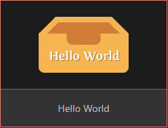
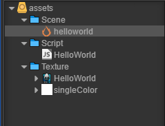
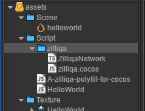
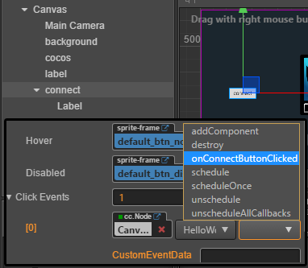
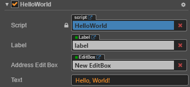
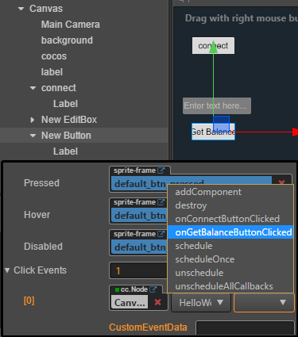
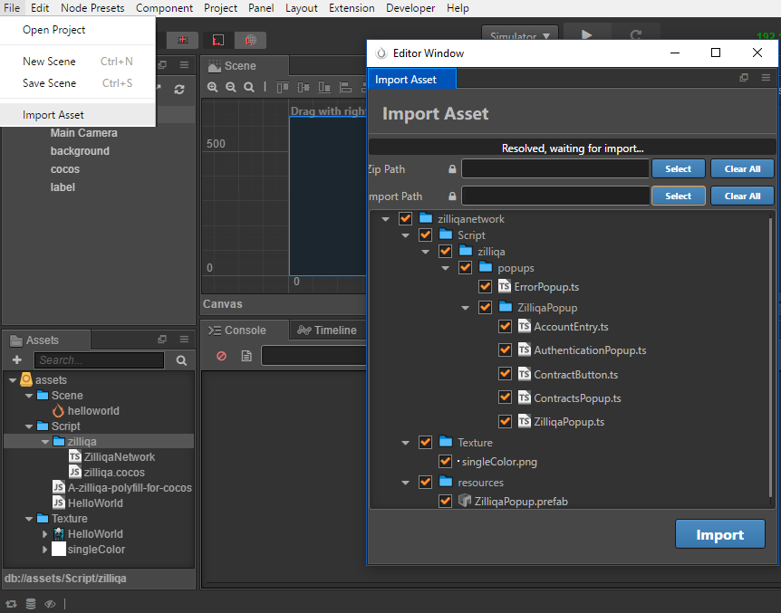
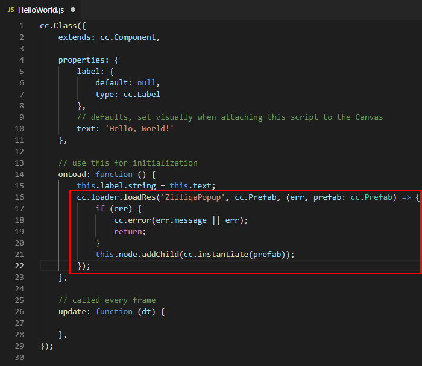

# 1. What is Cocos SDK
`Cocos Creator` is a complete package of game development tools and workflow, including a game engine (based on Cocos2d-x), resource management, scene editing, game preview, debug and publish one project to multiple platforms.
The `Zilliqa Cocos SDK` will allows developers easy to build a dapp on cocos creator run on `zilliqa blockchain`.

you can download Cocos Creator from [here](www.cocos.com/creator) , and install.

# 2. Features
* The `Zilliqa Cocos SDK` give a swapper layer named `ZilliqaNetwork.ts` to support work with all common thing like: `Connect to an endpoint`, `Managment wallet(s)`, `Deploy a contract`
* With each contract, it have different transition inside, so it need a contract binding be customized with its transitions. You can check [TicTacToeBinding](https://github.com/paladinlll/zilliqa-cocos-sdk/blob/master/sample/tictactoe/assets/Script/contracts/TicTacToeBinding.ts) sample.

# 3. Getting Started

`Cocos HelloWorld` + `Bundled Zilliqa-js` + `Zilliqa Network` + `Zilliqa test`
= `Hello Zilliqa`

## a. Init HelloWorld
Create new cocos creator project.\

## b. Generate ZilliqaJS SDK
*Currently I using zilliqa-js@0.3.1 and scilla-data-parser@0.0.8*
```shell
cd deps
yarn install

# bundle the sdk
yarn build
```

## c. Integrate to Creator Game
*(If the editor asked "Set as plug-in?" please press no)*
1. copy the `deps/dist/A-zilliqa-polyfill-for-cocos.js` to your project's asset/script. Make sure it will be loaded first.
2. copy the `deps/dist/zilliqa.cocos.js` to your project's asset/script directory inside zilliqa folder.
3. copy the `deps/dist/ZilliqaNetwork.ts` to your project's asset/script directory inside zilliqa folder.


## d. Add some tests
*(You also can skip this manual step and [import my test asset](#using-sample-assets))*
##### Connect
* Create a button, rename label to "Connect".
* Create onConnectButtonClicked in `HelloWorld.js` and link above button event to this.
```js
import ZilliqaNetwork from '../zilliqa/ZilliqaNetwork';
...
    onConnectButtonClicked: function() {
        var that = this;
        let URL = 'https://api.zilliqa.com/';
        this.label.string = 'Connecting to ' + URL;        
        ZilliqaNetwork.getInstance().connect(URL, function(err, data) {
            if (err || data.error) {                         
                that.label.string = 'Error ' + (err || data.error);
            } else {                                
                that.label.string = 'Connected to ' + data.result;
            }
        });
    },
```

##### Check Balance of an given address
* Create a editbox to get input address. Change Max Length to 64.
* Create addressEditBox property in `HelloWorld.js` and link above editbox to this.
```js
    properties: {
       ...
        addressEditBox: {
            default: null,
            type: cc.EditBox
        },
    },
```

* Create a button, rename label to "GetBalance".
* Create onGetBalanceButtonClicked in `HelloWorld.js` and link above button event to this.
```js
    ...
    onGetBalanceButtonClicked: function() {
        var that = this;
        this.label.string = 'getBalance...';
        ZilliqaNetwork.getInstance().getBalance(this.addressEditBox.string, function(err, data) {
            if (err || data.error) {                
                that.label.string = 'Error ' + (err || JSON.stringify(data.error));
            } else {               
                that.label.string = JSON.stringify(data.result);                
            }            
        });
    },
```


##### Using sample assets
Because create, store, and load an account is have many components and code so please try use my final asset
* Import `sample/zilliqanetwork.zip` to project.
* Create zilliqa popup in `HelloWorld` class.
 ```ts
    onLoad: function () {
        this.label.string = this.text;
        cc.loader.loadRes('ZilliqaPopup', cc.Prefab, (err, prefab) => {
            if (err) {
                cc.error(err.message || err);
                return;
            }
            this.node.addChild(cc.instantiate(prefab));      
        });
    }
 ```



# 4. Sample
There have two Sample project:
* [zilliqanetwork](https://github.com/paladinlll/zilliqa-cocos-sdk/tree/master/sample/zilliqanetwork) the final of Hello Zilliqa project.
* [tic-tac-toe](https://github.com/paladinlll/zilliqa-cocos-sdk/tree/master/sample/tictactoe) use zilliqa sdk in a real game.
