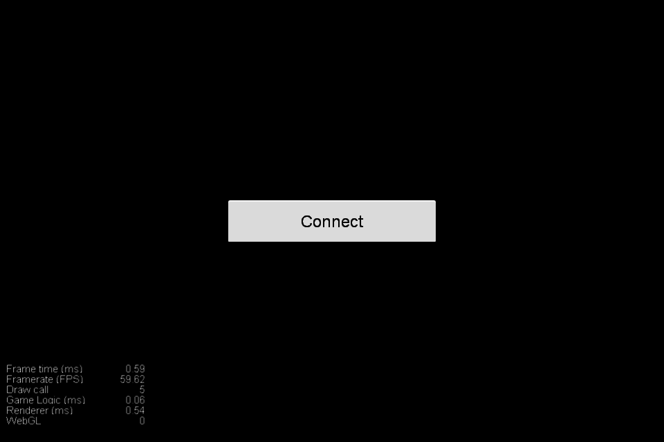
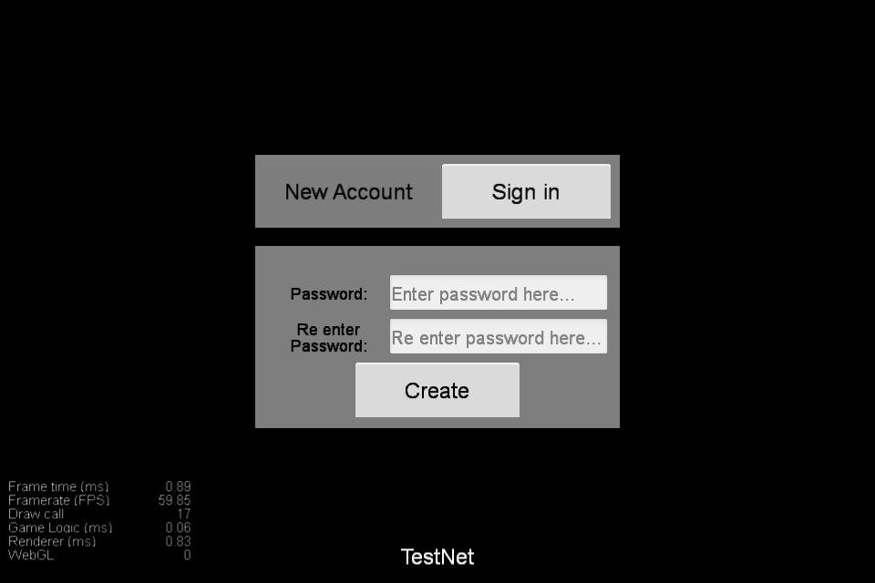
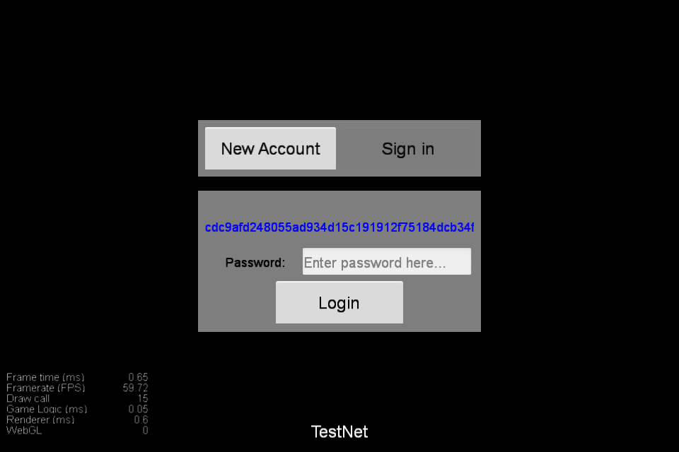
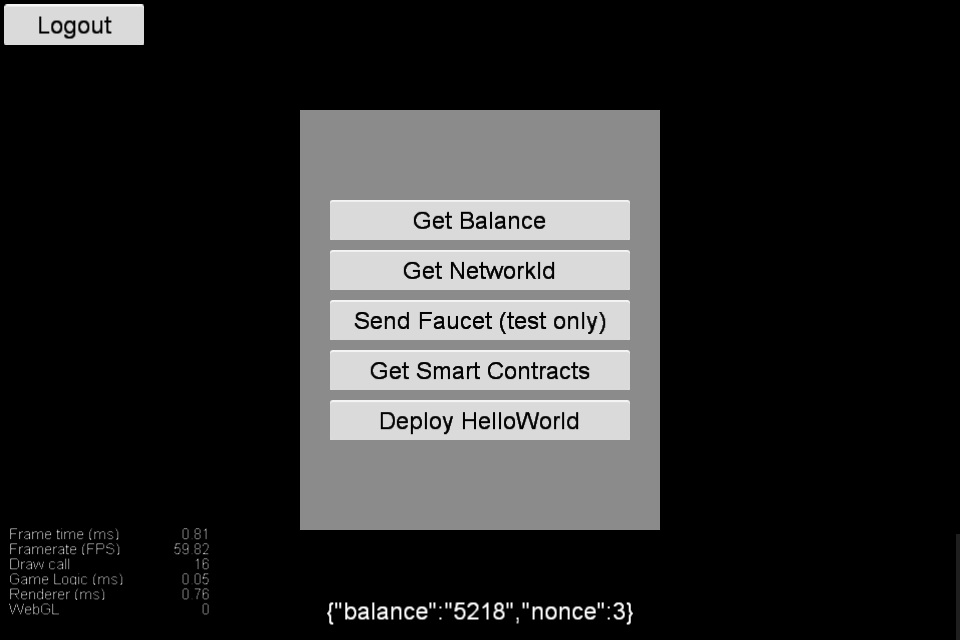
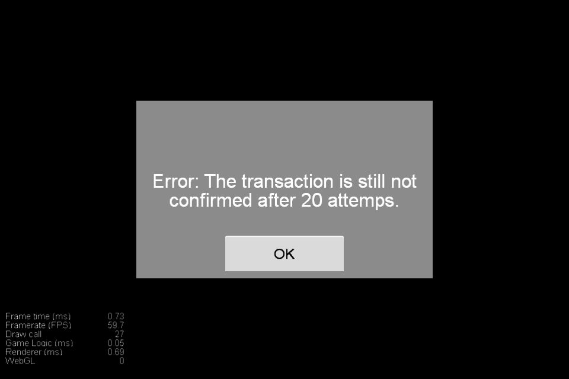

# zilliqanetwork
zilliqanetwork simplely use zilliqa sdk

# Swapper Funtions (ZilliqaNetwork.ts)
* `getUserAddress
* `wasAuthenticated
* `connect
* `getNetworkId
* `loadKeyStore
* `saveKeyStore
* `generateNewAccount
* `authorizeAccount
* `sendFaucetRequest
* `getBalance
* `deployHelloWorld

## Demo screen
* `Connect

* `Create account & Login

* `Main

* `Error
